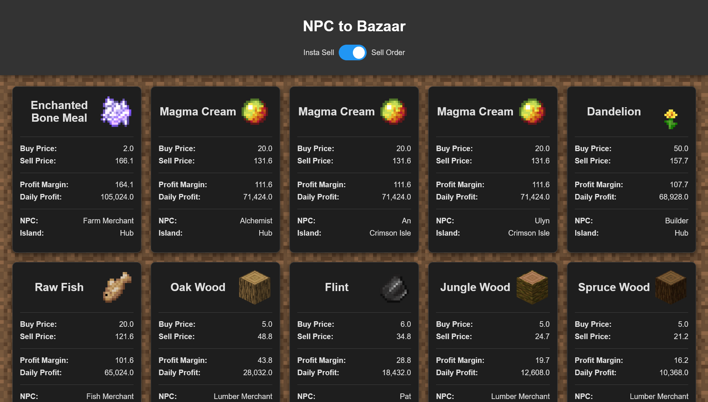

#  Angei SkyHelper

*Angei SkyHelper* is a web app designed to help *Hypixel SkyBlock* players maximize their profits and enhance their gameplay.

Our goal is to build a comprehensive toolset for the SkyBlock community, from beginners to advanced players.

While we currently focus on finding profitable items to [buy from NPCs and sell to the Bazaar](#npc-to-bazaar), we plan to add many more features eventually.

## Table of Contents
- [Features](#features)
- [Road Map](#road-map)
- [Community](#join-our-community)

## Features

### NPC to Bazaar

Angei SkyHelper’s NPC to Bazaar feature helps players discover items to buy from NPCs and sell for a profit on the Bazaar. Here are some of the key features:
<ul>
    <li><b>Toggle Sell Methods:</b> Choose whether to calculate profits based on Insta Sell or Sell Orders.</li>
    <li><b>Real-Time Data:</b> Powered by the Bazaar API, updated every minute for accurate insights.</li>
    <li><b>Optimized Loading:</b> Stores Item, NPC, and Bazaar data locally for quick loading.</li>
    <li><b>Beautiful Card-Based Design:</b> Items are displayed in individual cards with names, pictures, and relevant data, all sorted by profit (highest to lowest).</li>
    <li><b>Mobile-Friendly:</b> Fully responsive and optimized for smaller screens.</li>
</ul>

## Road Map

We have exciting plans for the future! Here are the features we aim to add:

### Homepage
<ul>
    <li>Create a welcoming hub that links to all current and future pages.</li>
</ul>

### NPC to Bazaar
<ul>
    <li>Add useful filters like minimum daily profit, sale volume, and max buy quantity.</li>
    <li>Improve sorting options to suit user preferences better.</li>
</ul>

### Skyblock Calendar
<ul>
    <li>Show in-game events with countdowns and schedules.</li>
    <li>Let users set reminders for upcoming events.</li>
</ul>

### User Accounts
<ul>
    <li>Allow users to save filters, preferences, and notifications.</li>
    <li>Sync everything across devices for convenience.</li>
</ul>

### Future Pages
<ul>
    <li>Build more easy-to-use pages to help the SkyBlock community!</li>
</ul>

## Join Our Community

We’re building Angei SkyHelper with the community in mind, and your feedback is important! Join our Discord server, [FiveCode Labs](https://discord.gg/SRHrAVF5), to:

- Share your thoughts and suggestions.
- Stay updated on the latest developments.
- Connect with other Hypixel SkyBlock players.

Your input will help shape the future of Angei SkyHelper, so don’t hesitate to get involved!

Stay tuned for updates as we continue to expand and improve Angei SkyHelper for the SkyBlock community. Thank you for your support!
